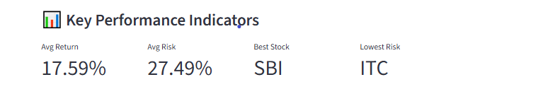
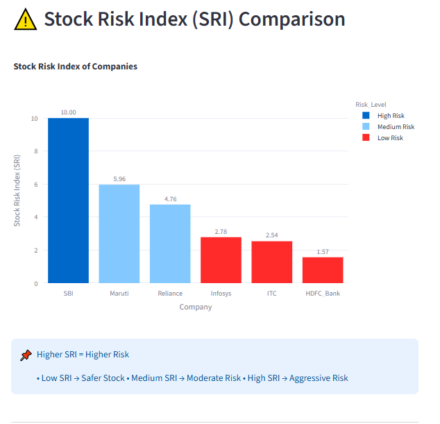

# 📈 Stock Price Prediction & Risk Scoring Dashboard
## Dashboard Screenshots

### KPI Overview

### Risk vs Return Analysis

### Stock Risk Index (SRI)

## Project Overview

This project combines Machine Learning, Financial Analytics, and Interactive Visualization to predict stock prices and evaluate investment risk.

The dashboard allows users to:

* Predict next-day stock prices using Machine Learning
* Analyze stock returns and volatility
* Compare risk levels across multiple companies
* Calculate a Stock Risk Index (SRI)
* Visualize Risk vs Return trade-offs
* Generate investment insights through an interactive Streamlit dashboard

---

## Technologies Used

* Python
* Pandas
* NumPy
* Scikit-Learn
* XGBoost
* Matplotlib
* Seaborn
* Plotly
* Streamlit

---

## Dataset

Historical stock market data for:

* HDFC Bank
* Infosys
* ITC
* Maruti Suzuki
* Reliance Industries
* State Bank of India (SBI)

Benchmark:

* NIFTY 50 Index

---

## Machine Learning Workflow

### 1. Data Collection

Collected and consolidated historical stock price data.

### 2. Exploratory Data Analysis (EDA)

* Trend Analysis
* Return Analysis
* Correlation Analysis
* Risk Assessment

### 3. Feature Engineering

Created:

* Moving Averages (MA7, MA21, MA50)
* Lag Features
* Rolling Mean
* Rolling Standard Deviation
* Daily Returns

### 4. Stock Price Prediction

Models Evaluated:

* Linear Regression
* Random Forest Regressor
* XGBoost Regressor

Best Performing Model:

* Linear Regression

Performance:

* R² Score: 0.9998
* MAE: 25.11
* RMSE: 68.88

---

## Risk Scoring Framework

Risk metrics calculated:

* Annual Return
* Annualized Volatility
* Sharpe Ratio
* Maximum Drawdown
* Beta vs NIFTY 50

Composite Risk Measure:

### Stock Risk Index (SRI)

Risk Categories:

* Low Risk
* Medium Risk
* High Risk

---

## Dashboard Features

* KPI Cards
* Risk vs Return Scatter Plot
* Stock Risk Index Comparison
* Stock Prediction Engine
* Buy/Hold Recommendations
* Investment Insights

---

## Project Structure

01_data_collection.ipynb

02_eda.ipynb

03_feature_engineering.ipynb

04_modeling.ipynb

05_risk_scoring.ipynb

06_dashboard.ipynb

07_streamlit_app.py

---

## Future Improvements

* LSTM Deep Learning Model
* Real-Time Stock Data Integration
* Portfolio Optimization Module
* Automated News Sentiment Analysis

---

## Author

Deepak Ranjan Das

PGPM Finance & Marketing | Data Analytics & Risk Analytics Enthusiast
